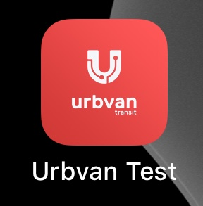
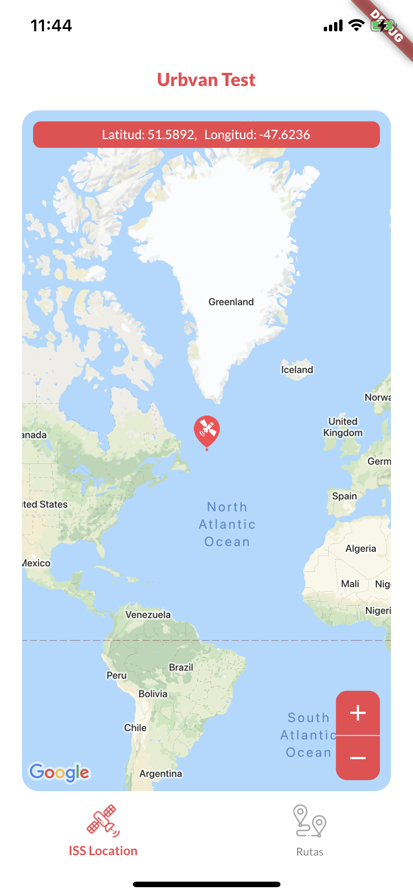
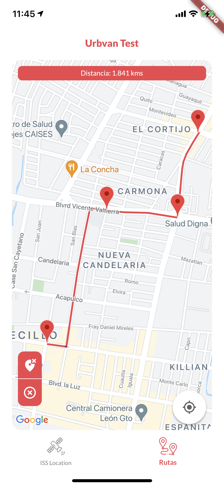
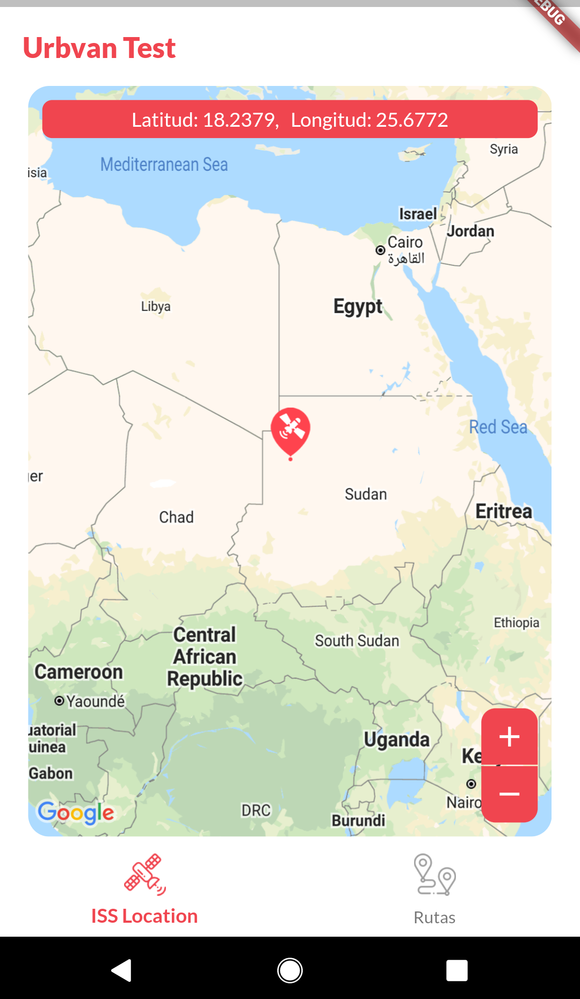
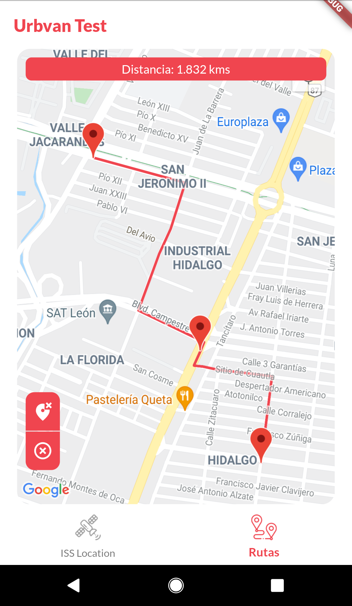

# Urbvan Test

Proyecto realizado para la prueba técnica de Urbvan

Este proyecto fue realizado y probado con la versión de Flutter número **1.27.0-2.0.pre.102**

Una vez descargado el proyecto seguir estos pasos:

### 1.- Instalación de paquetes

Correr dento del directorio del proyecto: \
**flutter pub get**

### 2.- Configuración de API Key de Google

Configurar la API Key de Google en los siguientes archivos:

- [android/app/src/main/AndroidManifest.xml](android/app/src/main/AndroidManifest.xml)
- [ios/Runner/AppDelegate.swift](ios/Runner/AppDelegate.swift)
- [lib/configuration.dart](lib/configuration.dart)

Substituir la cadena *'YOUR API KEY HERE'* por la API Key de Google

---

## Pantallas de muestra

-----

## Estructura del proyecto

- **Variables globales de configuración** ([configuration.dart](lib/configuration.dart)) : podrán configurarse los colores usados en la app, el intervalo de segundos para obtener la posición del ISS, la posición inicial del mapa y la API Key de Google.
- La estructura se divide en 2 directorios:
    - [**app**](lib/app) -  Se encuentra toda el UI de la app :
        - [**screens**](lib/app/screens) - Se encuentran las pantallas a mostrar dentro de la app :
            - [**home_screen.dart**](lib/app/screens/home_screen.dart) - Es la vista principal dónde se encuentran los tabs inferiores para seleccionar la sección deseada
            - [**issLocation_screen.dart**](lib/app/screens/issLocation_screen.dart) - Es la vista para mostrar el mapa dónde se muestra el marcador moviendose de acuerdo a la posición del ISS en latitud y longitud cada 10 segundos
            - [**routes_screen.dart**](lib/app/screens/routes_screen.dart) - Es la vista para mostrar el mapa dónde al hacer un tap prolongado se agrega un marcador en el mapa, cuando hay 2 o más marcadores se comienza a crear una ruta entre cada marcador. Existen 2 botones: uno para limpiar los marcadores y rutas del mapa, y otro para borrar el último marcador colocado en el mapa 
        - [**utils**](lib/app/utils) - Se encuentran funciones de ayuda :
            - [**geo_util.dart**](lib/app/utils/geo_util.dart) - Se encuentra la función *coordinateDistance* para obtener la distancia terrestre entre 2 puntos
            - [**image_util.dart**](lib/app/utils/image_util.dart) - Se encuentra la función *getBytesFromAsset* para crear el marcador a partir de un asset 
        - [**widgets**](lib/app/widgets) - Se encuentran widgets generales :
            - [**button_widget.dart**](lib/app/widgets/button_widget.dart) - Widget que crea un botón con texto, sólido o sólo contorno.
            - [**dialog_widget.dart**](lib/app/widgets/dialog_widget.dart) - Widget que crea un diálogo para mostrar mensajes de alerta o error.
    - [**core**](lib/core) - Se encuentra toda la lógica de modelos, api y controladores. Podrán crearse tantos modelos, controladores y api's conforme se necesiten en la app :
        - [**controllers/app_controller.dart**](lib/core/controllers/app_controller.dart) - Se encuentra el controlador de la app dónde se crea el Stream que estará consultando cada cierto tiempo la posición del ISS
        - [**models/issLocation_model.dart**](lib/core/models/issLocation_model.dart) - Es el clase del modelo para la respuesta de la API para obtener los datos del ISS
        - [**network/api.dart**](lib/core/network/api.dart) - Se encuentra la clase que obtendrá todos los servicios web que usará la app

----

## Tareas realizadas

- Maquetar las vistas de las pantallas.
- Creación de la parte backend para consultar la api del ISS y obtener su posición actual (json), el cuál se convierte a un objeto con sus propiedades específicas para el fácil acceso de sus datos.
- Crear el controlador que tendrá la parte de la obtención de la posición del ISS cada cierto tiempo y será escuchado en la pantalla de ISSLocation.
- Se creo la funcionalidad para hacer zoom (más/menos) en el mapa de ISSLocation para ver más a detalle por dónde se ubica el ISS, así cómo el detalle de latitud y longitud.
- Se creo la funcionalidad para limpiar todos los marcadores y rutas o el último marcador en el mapa de Rutas.
- Se crearon las imágenes personalizadas para el marcador del ISS, los íconos de los tabs de la vista principal y los íconos de las apps.
- Se obtuvo los colores y la fuente que actualmente se usa en la página web oficial para que la app vaya muy de la mano con el diseño actual.
- Se creo el repositorio en Github para subir todo el proyecto.

----

## Notas importantes
- Establecer los bundles necesarios sobre todo en iOS para ejecutar la app correctamente.
----

Desarrollado por: **Victor Manuel Aguado Alvarez** - [e-mail](mailto:vico_aguado@hotmail.com)

